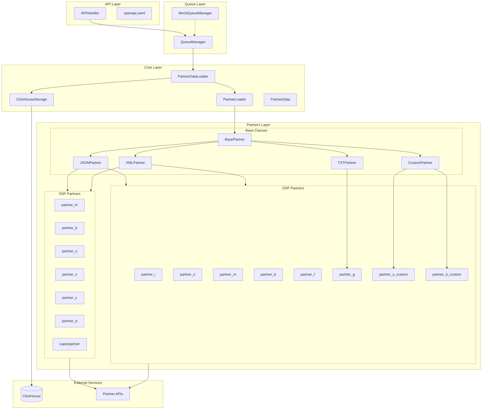

# Partners API Parser

Асинхронный парсер данных партнёров (SSP/DSP) с plugin-архитектурой.

## Архитектура

### Классовая UML-диаграмма

```mermaid
classDiagram
    direction TB

    %% Core Models
    class PartnerData {
        +date: date
        +dsp_id: int
        +ssp: str
        +imps: int
        +spent: float
        +currency: str
    }

    %% Abstract Base Partner
    class BasePartner {
        <<abstract>>
        +name: str
        +partner_type: PartnerType
        +currency: str
        +get_urls(start_date, end_date) List~str~
        +get_headers() dict | None
        +parse_response(data) List~PartnerData~
        +fetch_data(session, start_date, end_date)* List~PartnerData~
    }

    %% Partner Types Enum
    class PartnerType {
        <<enumeration>>
        SSP
        DSP
    }

    %% Response Format Enum
    class ResponseFormat {
        <<enumeration>>
        JSON
        XML
        TXT
    }

    %% Concrete Partner Implementations
    class JSONPartner {
        <<abstract>>
        +format: ResponseFormat = JSON
        +parse_json(data: dict) List~tuple~
        +fetch_data(session, start_date, end_date) List~PartnerData~
    }

    class XMLPartner {
        <<abstract>>
        +format: ResponseFormat = XML
        +parse_xml(root: Element) List~tuple~
        +fetch_data(session, start_date, end_date) List~PartnerData~
    }

    class TXTPartner {
        <<abstract>>
        +format: ResponseFormat = TXT
        +parse_txt(text: str) List~tuple~
        +fetch_data(session, start_date, end_date) List~PartnerData~
    }

    %% Custom Partner for special protocols
    class CustomPartner {
        <<abstract>>
        +fetch_data(session, start_date, end_date)* List~PartnerData~
    }

    %% Concrete SSP Partners
    class SSPPartnerM {
        +name = "ssp-partner-m"
        +partner_type = SSP
    }

    class SSPPartnerB {
        +name = "ssp-partner-b"
        +get_auth_token() str
    }

    class SSPSuperPartner {
        +name = "superpartner"
        +partner_type = SSP
    }

    %% Concrete DSP Partners
    class DSPPartnerI {
        +name = "dsp-partner-i"
        +dsp_id = 71
        +partner_type = DSP
    }

    class DSPPartnerS {
        +name = "dsp-partner-s"
        +dsp_id = 58
        +fetch_data() List~PartnerData~
    }

    class DSPPartnerG {
        +name = "dsp-partner-g"
        +dsp_id = 123
    }

    %% Core Services
    class PartnerLoader {
        +discover_partners() List~BasePartner~
        +get_partner(name: str) BasePartner
        +register_partner(partner: BasePartner)
    }

    class PartnerDataLoader {
        -storage: ClickHouseStorage
        -loader: PartnerLoader
        +load_all(start_date, end_date) List~PartnerData~
        +load_partner(name, start_date, end_date) List~PartnerData~
    }

    class ClickHouseStorage {
        -client: Client
        +insert(data: List~PartnerData~)
        +query(sql: str) DataFrame
    }

    %% Queue Integration
    class QueueManager {
        <<interface>>
        +enqueue(func, *args) Job
    }

    class MockQueueManager {
        +enqueue(func, *args) Job
    }

    %% API Layer
    class APIHandler {
        +partners_data_loader(start_date, end_date) dict
    }

    %% Inheritance relationships
    BasePartner <|-- JSONPartner
    BasePartner <|-- XMLPartner
    BasePartner <|-- TXTPartner
    BasePartner <|-- CustomPartner

    JSONPartner <|-- SSPPartnerM
    JSONPartner <|-- SSPPartnerB
    JSONPartner <|-- SSPPartnerO
    JSONPartner <|-- SSPPartnerS
    JSONPartner <|-- SSPSuperPartner
    JSONPartner <|-- DSPPartnerI
    JSONPartner <|-- DSPPartnerO
    JSONPartner <|-- DSPPartnerM
    JSONPartner <|-- DSPPartnerB

    XMLPartner <|-- SSPPartnerC
    XMLPartner <|-- SSPPartnerD
    XMLPartner <|-- DSPPartnerF

    TXTPartner <|-- DSPPartnerG

    CustomPartner <|-- DSPPartnerS
    CustomPartner <|-- DSPPartnerBCustom

    %% Composition/Association
    BasePartner --> PartnerType
    BasePartner --> PartnerData : creates
    JSONPartner --> ResponseFormat
    XMLPartner --> ResponseFormat
    TXTPartner --> ResponseFormat

    PartnerLoader --> BasePartner : manages
    PartnerDataLoader --> PartnerLoader : uses
    PartnerDataLoader --> ClickHouseStorage : uses

    APIHandler --> QueueManager : uses
    APIHandler --> PartnerDataLoader : triggers
    MockQueueManager ..|> QueueManager
```



### Компонентная диаграмма



## Структура проекта

```
src/
├── partners/
│   ├── __init__.py
│   ├── base.py              # BasePartner, PartnerType, ResponseFormat
│   ├── json_partner.py      # JSONPartner base class
│   ├── xml_partner.py       # XMLPartner base class
│   ├── txt_partner.py       # TXTPartner base class
│   ├── custom_partner.py    # CustomPartner base class
│   ├── ssp/
│   │   ├── __init__.py
│   │   ├── partner_m.py
│   │   ├── partner_b.py
│   │   ├── partner_o.py
│   │   ├── partner_s.py
│   │   ├── partner_c.py
│   │   ├── partner_d.py
│   │   └── superpartner.py  # New partner
│   └── dsp/
│       ├── __init__.py
│       ├── partner_i.py
│       ├── partner_o.py
│       ├── partner_m.py
│       ├── partner_b.py
│       ├── partner_f.py
│       ├── partner_g.py
│       ├── partner_s_custom.py
│       └── partner_b_custom.py
├── core/
│   ├── __init__.py
│   ├── models.py            # PartnerData dataclass
│   ├── storage.py           # ClickHouseStorage
│   ├── loader.py            # PartnerLoader, auto-discovery
│   └── data_loader.py       # PartnerDataLoader (async orchestrator)
├── api/
│   ├── __init__.py
│   ├── handlers.py          # Connexion API handlers
│   └── openapi.yaml         # OpenAPI spec
├── queue/
│   ├── __init__.py
│   └── manager.py           # QueueManager interface + MockQueueManager
└── config.py                # Configuration management
tests/
├── __init__.py
├── conftest.py              # Fixtures
├── test_partners/
│   ├── test_json_partners.py
│   ├── test_xml_partners.py
│   └── test_custom_partners.py
├── test_core/
│   ├── test_loader.py
│   ├── test_storage.py
│   └── test_data_loader.py
└── test_api/
    └── test_handlers.py
```

## Установка

```bash
# Установка зависимостей
pip install -e ".[dev]"

# Запуск тестов
pytest

# Запуск линтеров
ruff check src tests
ruff format src tests
mypy src
```

## Добавление нового партнёра

### 1. JSON-партнёр (типичный случай)

```python
# src/partners/ssp/new_partner.py
from src.partners.json_partner import JSONPartner
from src.partners.base import PartnerType

class NewPartner(JSONPartner):
    name = "new-partner"
    partner_type = PartnerType.SSP
    currency = "usd"

    def get_urls(self, start_date: str, end_date: str) -> list[str]:
        return [f"https://api.newpartner.com/stats?from={start_date}&to={end_date}"]

    def get_headers(self) -> dict | None:
        return {"Authorization": f"Bearer {self.config.NEW_PARTNER_TOKEN}"}

    def parse_json(self, data: dict) -> list[tuple]:
        # Return list of (date, impressions, revenue) tuples
        return [(item["date"], item["imps"], item["revenue"]) for item in data["items"]]
```

### 2. XML-партнёр

```python
# src/partners/dsp/xml_partner_example.py
from src.partners.xml_partner import XMLPartner
from src.partners.base import PartnerType
from xml.etree.ElementTree import Element

class XMLPartnerExample(XMLPartner):
    name = "xml-partner"
    partner_type = PartnerType.DSP
    dsp_id = 999

    def parse_xml(self, root: Element) -> list[tuple]:
        return [
            (item.attrib["date"], int(item.find("imps").text), float(item.find("rev").text))
            for item in root
        ]
```

### 3. Кастомный партнёр (нестандартный протокол)

```python
# src/partners/dsp/custom_example.py
from src.partners.custom_partner import CustomPartner
from src.core.models import PartnerData

class CustomExample(CustomPartner):
    name = "custom-partner"
    partner_type = PartnerType.DSP
    dsp_id = 888

    async def fetch_data(self, session, start_date, end_date) -> list[PartnerData]:
        # Implement custom logic (XMLRPC, SOAP, etc.)
        ...
```

## Конфигурация

Все credentials хранятся в переменных окружения:

```bash
export PARTNER_M_SSP_ACCESS_TOKEN="..."
export PARTNER_B_SSP_LOGIN="..."
export CLICKHOUSE_HOST="..."
```

## API

### POST /api/load_data_partners/enqueue

Запускает асинхронную загрузку данных партнёров.

**Parameters:**
- `start_date` (optional): Начальная дата (YYYY-MM-DD)
- `end_date` (optional): Конечная дата (YYYY-MM-DD)

**Response:**
```json
{
  "job_id": "uuid-string"
}
```
